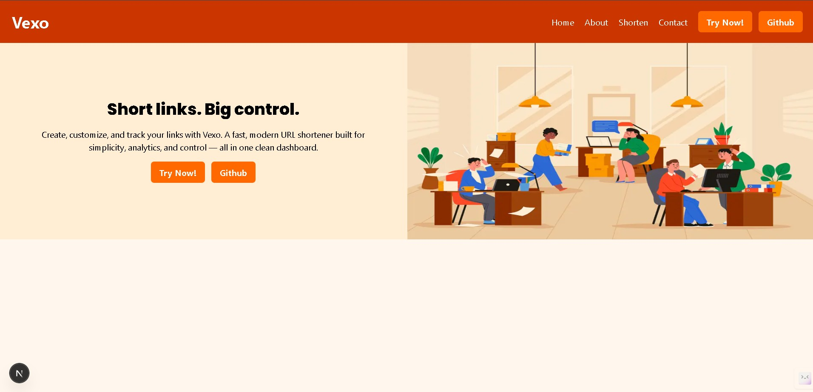
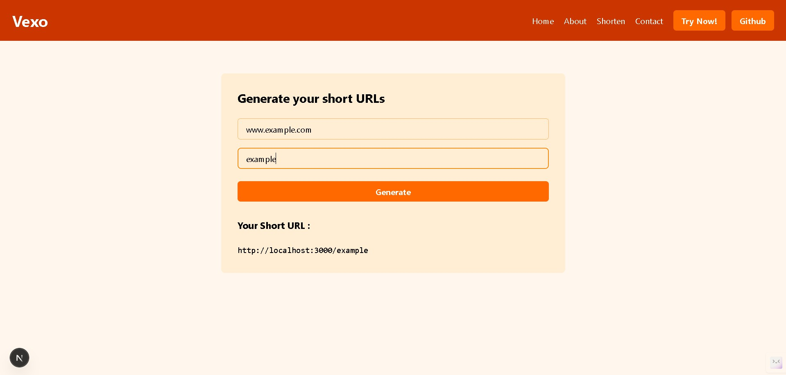

# 🚀 Vexo — Modern URL Shortener

Vexo is a modern, full-stack URL shortener built using **Next.js App Router** and **MongoDB**.  
It allows users to generate custom short URLs that reliably redirect to the original destination using server-side routing.

This project focuses on correct Next.js patterns, clean backend logic, and real-world debugging — not just CRUD operations.

---

## ✨ Features

- 🔗 Generate custom short URLs  
- 🚀 Server-side redirects using Next.js App Router  
- 🗄️ Persistent storage with MongoDB  
- ⚡ Fast URL resolution via dynamic routes  
- 🧠 Proper handling of async route params  
- 🔒 Duplicate short URL validation  
- 🌐 Environment-based configuration  

---

## 🛠️ Tech Stack

- **Frontend:** Next.js (App Router), React, Tailwind CSS  
- **Backend:** Next.js API Routes  
- **Database:** MongoDB (Node.js Driver)  
- **Styling:** Tailwind CSS  
- **Runtime:** Node.js  


---
## 📸 Preview 



---

## 📂 Project Structure
app/ 

├── page.js                  # Landing page

├── shorten/

│   └── page.js              # URL generation page

├── [shorturl]/

│   └── page.js              # Dynamic redirect handler

├── api/

│   └── generate/

│       └── route.js         # API to generate short URLs

lib/

└── mongodb.js                # MongoDB connection helper


---

## ⚙️ Environment Variables

Create a `.env.local` file in the root directory:

```env
MONGODB_URI=mongodb://localhost:27017
NEXT_PUBLIC_HOST=http://localhost:3000
```
⚠️ Restart the dev server after setting environment variables.

## ▶️ Getting Started

### 1️⃣ Clone the repository
```
git clone https://github.com/aakashaygonde/vexo.git
cd vexo
```
### 2️⃣ Install dependencies
```
npm install
```

### 3️⃣ Start MongoDB

Ensure MongoDB is running locally or update the URI for MongoDB Atlas.

### 4️⃣ Run the development server
```
npm run dev
```
### Open: 👉 http://localhost:3000

## 🧠 Key Learnings
- Dynamic routing with Next.js App Router
- Handling async route parameters (await params)
- Server-side redirects vs client navigation
- MongoDB integration with connection caching
- Designing backend responses for frontend consumption

## 🚧 Future Improvements
- 📊 Click analytics
- ⏳ Expiring short URLs
- 📉 Dashboard for managing links
- 🧾 404 page for invalid short URLs
- 🔐 Authentication & user-based links

